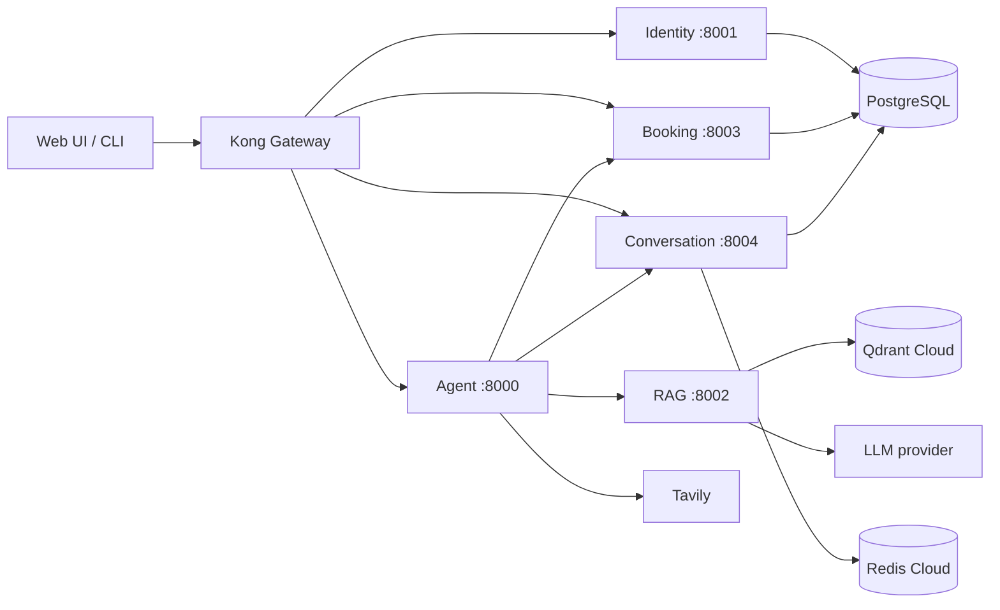
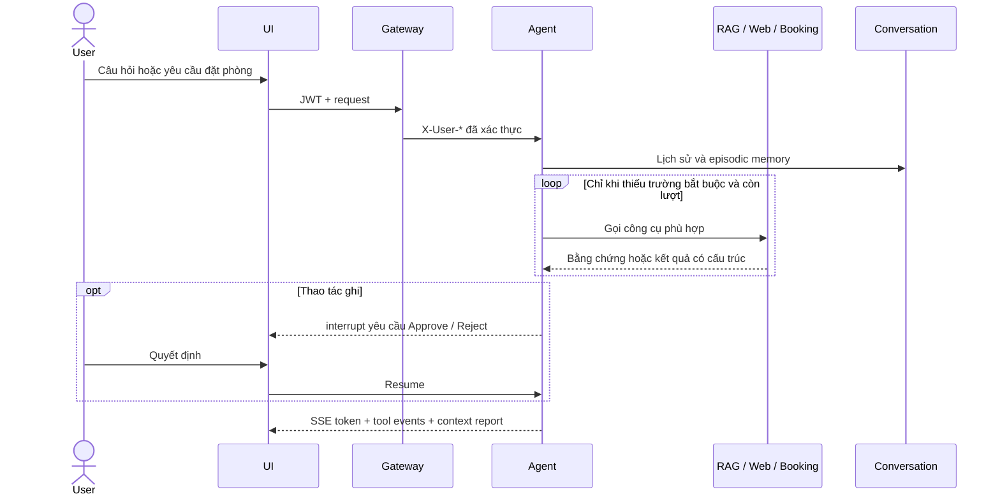
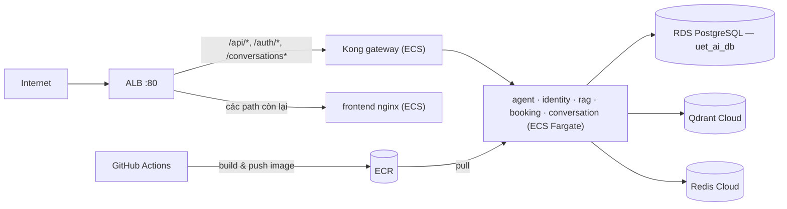

# UET AI Assistant

Trợ lý đại học đa tác tử dành cho UET: hỏi đáp theo tài liệu, tra cứu web,
quản lý phòng và lịch đặt phòng, lưu hội thoại và tóm tắt trí nhớ theo từng
luồng. Hệ thống chạy sau Kong API Gateway, hỗ trợ JWT, SSE streaming và bước
phê duyệt của người dùng trước mọi thao tác ghi.

## Kiến trúc





## Thành phần

| Thành phần | Trách nhiệm |
|---|---|
| agent | LangGraph router và các subgraph FAQ, search, booking, general chat |
| rag | Nạp PDF, hybrid search dense/BM25, RRF, rerank, MMR, HyDE và semantic cache |
| identity | Đăng ký, đăng nhập, bcrypt và JWT HS256 |
| booking | Danh mục 24 phòng minh họa, kiểm tra trạng thái, trùng lịch và CRUD |
| conversation | Hội thoại, đồng bộ message, Redis exact-match cache và episodic summary |
| gateway | Xác minh JWT, rate limit, CORS và truyền identity header |
| frontend | Giao diện chat, lịch sử, streaming, tool status và HITL |

Prompt nằm cùng miền agent tại services/agent/prompts/. Mỗi prompt tác tử quy
định rõ trường bắt buộc theo loại thực thể, điều kiện tiếp tục gọi tool, điều
kiện dừng, giới hạn lượt và cách công bố trường còn thiếu. Ví dụ, hồ sơ cá nhân
cần họ tên, vai trò/đơn vị, email và số điện thoại khi nguồn có; phòng cần mã
phòng, cơ sở, loại, sức chứa, trạng thái, thiết bị và địa chỉ hoặc tuyên bố rõ
địa chỉ không có trong nguồn.

## Chạy local

Yêu cầu: Python 3.11+, uv, Docker Compose và tài khoản Qdrant Cloud/Redis
Cloud. Tạo .env từ .env.example rồi điền khóa thật; tuyệt đối không commit
.env.

```bash
uv sync
cp .env.example .env
bash scripts/local.sh
```

Sau khi khởi động:

- Web UI: http://localhost:3000
- Kong Gateway: http://localhost:8080
- Health ports: agent 8000, identity 8001, rag 8002, booking 8003,
  conversation 8004
- CLI: uv run python cli.py

local.sh dùng PostgreSQL trong Docker, năm dịch vụ Python chạy native, Kong và
frontend chạy container. Qdrant và Redis luôn là dịch vụ cloud theo .env.
Script kiểm tra SHA-256 của data/UET_HR.pdf và tự nạp lại collection khi tài
liệu đổi.

Các lệnh quản trị:

```bash
bash scripts/local.sh status
bash scripts/local.sh stop
bash scripts/local.sh down
```

## Dữ liệu và phòng

- Nguồn duy nhất được version-control là data/UET_HR.pdf.
- Collection mặc định: uet_hr_docs và uet_hr_cache.
- Nạp lại thủ công sẽ thay thế collection knowledge base hiện tại:

```bash
uv run python scripts/create_collections.py
uv run python -m services.rag.ingestion.run --file data/UET_HR.pdf
```

Danh mục phòng ở Section C của PDF là dữ liệu minh họa. API chỉ cho đặt phòng
có status ACTIVE. Các phòng MAINTENANCE hoặc RESTRICTED vẫn có thể xuất hiện
khi tra cứu nhưng không được đặt.

## Kiểm thử

```bash
uv run ruff check .
uv run pytest -q
uv run python eval/service_smoke_test.py
uv run python eval/flow_test.py
UI_E2E_LIMIT_PER_SECTION=1 uv run python eval/ui_e2e_playwright.py
RAGAS_LIMIT=6 uv run python eval/evaluate_ragas.py
```

service_smoke_test kiểm tra identity/JWT, booking, conversation, Redis,
summarization, RAG/Qdrant, agent và gateway. UI E2E chạy trình duyệt Chromium
thật qua frontend. evaluate_ragas lấy context từ RAG service thay vì dùng
context giả.

## Triển khai AWS

Hạ tầng production được provision bằng Terraform (thư mục terraform/) trên
region ap-southeast-1:

- VPC riêng: subnet public cho ALB, subnet private cho ECS/RDS, một NAT
  gateway cho toàn bộ outbound (ECR, Qdrant Cloud, Redis Cloud, LLM, Tavily).
- 7 ECS Fargate service — uet-{agent, identity, rag, booking, conversation,
  gateway, frontend} — chạy image từ 7 ECR repository tương ứng.
- Service discovery qua ECS Service Connect / Cloud Map với đúng tên ngắn dùng
  trong kong.yml: agent, identity, rag, booking, conversation, gateway.
- RDS PostgreSQL 16 (database uet_ai_db), secret trong Secrets Manager, log
  tập trung ở CloudWatch, S3 cho upload tài liệu (tùy chọn).
- ALB internet-facing định tuyến: /api/*, /auth/* và /conversations* vào Kong;
  mọi path còn lại phục vụ frontend nginx.
- Qdrant và Redis luôn là managed cloud (Qdrant Cloud / Redis Cloud) —
  Terraform không tạo container hay instance cho hai thành phần này.



CI/CD chạy qua .github/workflows/ci-cd.yml: PR chỉ chạy ruff + offline test
(tests/test_graph.py); push lên main build cả 7 image, đẩy lên ECR rồi force
deployment toàn bộ ECS service. Lần deploy đầu tiên làm theo thứ tự bootstrap
trong terraform/README.md (desired count = 0 → push image → scale lên) để ECS
không khởi động trước khi ECR có image. Script deploy thủ công:
scripts/deploy-prod.sh; sơ đồ và IAM chi tiết: docs/aws-deployment.md.

## Bảo mật và vận hành

- Gateway YAML chỉ chứa placeholder; secret được render từ môi trường.
- JWT_SECRET_KEY, GATEWAY_SHARED_SECRET, INTERNAL_API_TOKEN, API key và URL có
  credential không được commit.
- Agent từ chối direct request khi AGENT_REQUIRE_GATEWAY=true.
- Booking write luôn dừng ở HITL trước khi ghi.
- Redis lỗi sẽ graceful fallback về database; Qdrant lỗi khiến bước khởi động
  fail-fast vì RAG không còn đáng tin cậy.
- Episodic memory tách theo user và conversation thread, lưu SQL, không chia sẻ
  chéo luồng.

Chi tiết API và thiết kế nằm trong docs/. Dự án không dùng ảnh tài liệu cũ;
các sơ đồ được giữ dưới dạng Mermaid để dễ audit và cập nhật.

## Cấu trúc chính

```text
services/
  agent/
    agents/
    prompts/
  identity/
  rag/
  booking/
  conversation/
  gateway/
  frontend/
eval/
scripts/
docs/
terraform/
data/UET_HR.pdf
```

## License

Chưa khai báo license. Không mặc định coi mã nguồn hoặc dữ liệu là public
domain.
