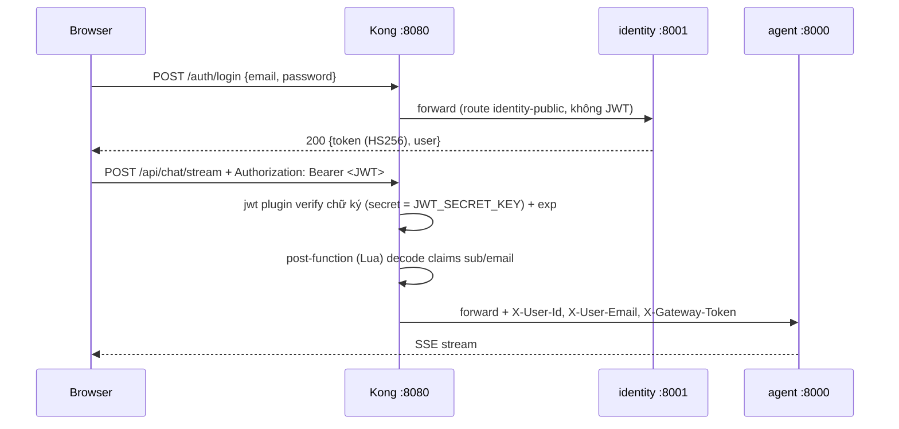
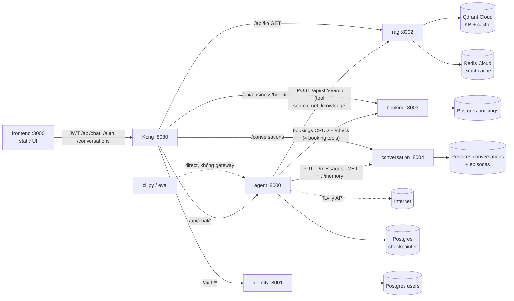
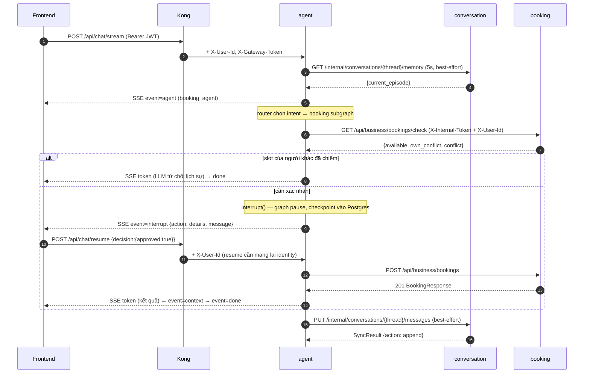

# API Design — UET AI Assistant (`uet-hr-ai`)

> Tài liệu này mô tả **thiết kế API của từng service** và **cách các service liên kết
> với nhau** (gateway routing, service-to-service calls, auth headers, error contract).
> Sơ đồ hệ thống tổng quan: [`architecture.md`](architecture.md). Blueprint từng file: `hint.md`.

Mục lục:

1. [Nguyên tắc thiết kế chung](#1-nguyên-tắc-thiết-kế-chung)
2. [Gateway routing (Kong)](#2-gateway-routing-kong)
3. [API từng service](#3-api-từng-service)
4. [Các service liên kết với nhau thế nào](#4-các-service-liên-kết-với-nhau-thế-nào)
5. [Error & timeout contract](#5-error--timeout-contract)
6. [Gotchas](#6-gotchas)

---

## 1. Nguyên tắc thiết kế chung

Toàn bộ HTTP API của hệ thống tuân theo 6 quyết định thiết kế sau:

### 1.1 Hai "trust plane" tách biệt: external qua gateway, internal gọi thẳng

| Plane | Đường đi | Credential | Identity |
|---|---|---|---|
| **External** (browser/CLI) | Kong gateway `:8080` | `Authorization: Bearer <JWT>` | Kong verify JWT → inject `X-User-Id` / `X-User-Email` / `X-Gateway-Token` |
| **Internal** (service → service) | Gọi thẳng URL service (`httpx`) | `X-Internal-Token` hoặc `X-Internal-Api-Token` (shared secret) | Caller tự set `X-User-Id` của end-user mà nó đại diện |

Không có service business nào tự parse JWT (trừ identity khi bị gọi direct). JWT chỉ
được verify **một lần tại Kong**; phía sau gateway, các service chỉ đọc header tin cậy
`X-User-Id` do Kong inject. Đây là pattern *edge authentication / trusted header* —
industry-standard cho API gateway.

### 1.2 Owner enforcement: header luôn thắng query param

Mọi endpoint đụng tới dữ liệu theo user (booking, conversation) resolve identity theo
thứ tự: **`X-User-Id` header (tin cậy) → fallback `?user_id=` (legacy internal)**.
Client bên ngoài không thể mạo danh vì Kong **ghi đè** header từ JWT đã verify.
Service tầng dưới enforce owner lần nữa (`PermissionError` → 403) — defense in depth,
không chỉ dựa vào gateway.

### 1.3 Một prefix duy nhất cho một domain, mount không strip path

Mỗi service mount router dưới một prefix ổn định, Kong route theo đúng prefix đó với
`strip_path: false` — nghĩa là **path qua gateway giống hệt path gốc của service**:

```
browser ──► Kong :8080 /api/chat/stream ──► agent :8000 /api/chat/stream   (giữ nguyên path)
```

### 1.4 Chat là SSE stream, không phải request/response

Endpoint chat trả `text/event-stream` với **event contract riêng** (mục 3.2). Lý do:
một turn agent gồm router → subgraph → nhiều tool call → nhiều token LLM; client cần
thấy tiến trình real-time thay vì đợi toàn bộ kết quả. Kèm 2 cơ chế production cho
SSE sau reverse proxy:

- **Heartbeat** `: ping\n\n` mỗi 15s khi stream im lặng (ALB idle 60s / Kong read
  timeout sẽ cắt kết nối nếu không có byte nào chảy).
- **Anti-buffer headers**: `Cache-Control: no-cache`, `X-Accel-Buffering: no` (tắt
  proxy buffering của nginx/Kong để event chảy real-time).

### 1.5 HITL: interrupt TRƯỚC mọi write nhạy cảm

Booking create/cancel/reschedule không bao giờ ghi DB trực tiếp. Tool gọi
`interrupt()` của LangGraph → graph **tạm dừng**, payload xác nhận bay ra client qua
SSE event `interrupt` → client gọi `POST /api/chat/resume` với quyết định của con
người → graph chạy tiếp và chỉ khi đó mới write. Read-only probe (`GET /check`) được
gọi TRƯỚC interrupt để từ chối sớm các ca chắc chắn fail (slot của người khác đã
chiếm) — không bắt user approve một thứ không thể thành công.

### 1.6 Best-effort cho các call không nằm trên critical path

Các call phục vụ "nice-to-have" (memory injection, history sync) được thiết kế
**không bao giờ làm hỏng turn chat**: timeout ngắn (5–10s), mọi exception chỉ log và
trả `None`/payload lỗi có cấu trúc. Ngược lại, tool call nghiệp vụ (RAG search, booking)
trả **structured error payload** (`status: error`, `error_code`, message tiếng Việt) để
LLM nói thật với user thay vì bịa kết quả.

Mọi service đều có `GET /health` (liveness probe cho `local.sh status`, Docker/ECS
healthcheck, ALB target).

---

## 2. Gateway routing (Kong)

Kong chạy **DB-less** từ `services/gateway/declarative/kong.yml`. Secrets là
placeholder (`__JWT_SECRET__`, `__GATEWAY_SHARED_SECRET__`, `__<SVC>_UPSTREAM__`) được
`render-config.sh` render lúc container start từ env — không sửa giá trị đã render.

### 2.1 Bảng route

| Kong route | Path prefix | Method | JWT? | Upstream | Ghi chú |
|---|---|---|---|---|---|
| `identity-public` | `/auth/register`, `/auth/login` | POST, OPTIONS | ❌ | identity `:8001` | public — chưa có token |
| `identity-protected` | `/auth/me` | GET, OPTIONS | ✅ | identity `:8001` | |
| `agent-chat` | `/api/chat` | all | ✅ | agent `:8000` | SSE stream + resume |
| `rag-kb` | `/api/kb` | **GET, OPTIONS** | ❌ | rag `:8002` | chỉ expose endpoint đọc (`/health`, `/cache/stats`) — `POST /search` **không** qua gateway, agent gọi thẳng |
| `booking-routes` | `/api/business/bookings` | all | ✅ | booking `:8003` | |
| `conversation-routes` | `/conversations` | all | ✅ | conversation `:8004` | `/internal/conversations` **không khớp** prefix này → internal API không lộ ra ngoài |

Global plugins (mọi route): **CORS** (`*`, cho phép header `Authorization`,
`X-Gateway-Token`) + **rate-limiting** 120 request/phút (policy local).

### 2.2 Flow xác thực qua gateway



Chi tiết quan trọng:

- **identity phát hành JWT** (`iss = uet-identity`, HS256, secret = `JWT_SECRET_KEY`);
  Kong consumer `uet-users` giữ cùng secret để verify. Identity và Kong phải dùng
  chung một `JWT_SECRET_KEY`.
- **post-function Lua** decode payload JWT (base64URL, tự pad `=`) rồi inject 3 header:
  `X-User-Id` (claim `sub`), `X-User-Email` (claim `email`), `X-Gateway-Token`
  (= `GATEWAY_SHARED_SECRET`). Một block Lua giống hệt nhau cho mỗi protected route.
- Upstream có thể bật cờ "chỉ nhận request từ gateway": agent dùng
  `AGENT_REQUIRE_GATEWAY=true` → reject (401) nếu `X-Gateway-Token` sai/thiếu; local
  dev tắt cờ này để CLI/eval gọi thẳng.

---

## 3. API từng service

### 3.1 identity — `:8001` (prefix `/auth`)

Quản lý user + phát hành JWT. Package-by-feature: `security/` (hashing bcrypt, JWT
HS256) + `users/` (routes, service, repository, schemas).

| Method | Path | Auth | Request | Response |
|---|---|---|---|---|
| POST | `/auth/register` | public | `{email, password (≥6), name}` | **201** `AuthResponse` · 409 email trùng · 422 validate |
| POST | `/auth/login` | public | `{email, password}` | **200** `AuthResponse` · 401 sai credentials |
| GET | `/auth/me` | JWT (gateway) hoặc `Authorization: Bearer` (direct) | — | **200** `UserProfile` · 401 · 404 |
| GET | `/health` | none | — | `{status}` |

```jsonc
// AuthResponse
{
  "token": "<JWT HS256>",
  "token_type": "bearer",
  "user": { "user_id": "...", "email": "...", "name": "...", "created_at": "..." }
}
```

Design note: `GET /auth/me` chấp nhận **2 nguồn identity** — `X-User-Id` (gateway
inject, tin cậy) trước, rồi mới tự decode Bearer JWT (cho CLI local gọi thẳng không
qua Kong). Email được chuẩn hóa lowercase ngay ở pydantic validator.

### 3.2 agent — `:8000` (prefix `/api/chat`)

Orchestrator LangGraph. Chỉ 2 endpoint nghiệp vụ, cả hai đều trả **SSE stream**:

| Method | Path | Auth | Request |
|---|---|---|---|
| POST | `/api/chat/stream` | gateway (`X-Gateway-Token` khi `AGENT_REQUIRE_GATEWAY=true`) | `ChatRequest` |
| POST | `/api/chat/resume` | như trên | `ResumeRequest` |
| GET | `/health` | none | — |

```jsonc
// ChatRequest
{ "thread_id": "...", "message": "...", "user_id": "anonymous", "email": null }
// ResumeRequest — decision là payload người dùng approve/reject
{ "thread_id": "...", "decision": { "approved": true }, "user_id": "...", "email": null }
```

Identity resolution: khi gateway enforcement bật, `X-User-Id`/`X-User-Email` do Kong
inject **thắng** field trong body; khi tắt (local CLI/eval) dùng body. `user_id` được
đưa vào `config.configurable` của LangGraph để tool booking dùng làm owner.
Sau khi `interrupt()`, graph resume với `RunnableConfig` **mới** nên `ResumeRequest`
phải mang lại `user_id`/`email` — thiếu là tool rơi về owner default (gotcha).

#### SSE event contract

Mỗi frame là `data: {json}\n\n` với field `event`:

| `event` | `data` | Khi nào |
|---|---|---|
| `agent` | `{name: intent, label: "<tiếng Việt>"}` | 1 lần/turn, ngay sau khi router chọn intent (`faq_agent` / `search_agent` / `booking_agent` / `general_chat`) — UI hiện badge agent đang trả lời |
| `token` | string | từng token LLM stream (token JSON nội bộ của router bị lọc, không bao giờ lộ ra client) |
| `tool` | `{name, status: "start"\|"end"}` | mỗi tool call bắt đầu/kết thúc |
| `interrupt` | `{action, details, message}` | graph tạm dừng chờ HITL — client render nút Approve/Reject rồi gọi `/api/chat/resume` |
| `context` | `ContextReport` | turn hoàn tất: báo cáo context engineering (memory injected, history trim, token budget) cho UI minh bạch |
| `done` | `"Completed"` | turn hoàn tất |
| `error` | string | exception trong stream |

```jsonc
// ContextReport (dataclass, JSON-safe, đi qua Postgres checkpointer)
{
  "system_prompt_tokens": 1776, "system_over_budget": true,
  "memory_injected": true,
  "history_messages_in": 24, "history_messages_out": 10,
  "history_tokens": 2100, "history_trimmed": true,
  "tool_outputs_capped": 2
}
```

Xen kẽ bất kỳ lúc nào có thể là frame comment `: ping\n\n` (heartbeat 15s) — parser
client phải bỏ qua frame không bắt đầu bằng `data:`.

### 3.3 rag — `:8002` (prefix `/api/kb`)

Retrieval pipeline: semantic cache → hybrid (dense + BM25 + RRF) → HyDE fallback →
rerank (cross-encoder, lazy-load) → MMR.

| Method | Path | Qua gateway? | Request | Response |
|---|---|---|---|---|
| POST | `/api/kb/search` | ❌ (internal — agent gọi thẳng) | `SearchRequest` | `SearchResponse` |
| GET | `/api/kb/health` | ✅ | — | `{status: "healthy"}` |
| GET | `/api/kb/cache/stats` | ✅ | — | cache hit/miss/rate/TTL |
| GET | `/health` | — (direct) | — | `{status: "ok"}` |

```jsonc
// SearchRequest
{ "query": "...", "top_k": 5,      // 1..20
  "diversity": 0.7 }               // MMR lambda 0..1

// SearchResponse
{
  "results": [ { "text": "...", "source": "UET_HR.pdf",
                 "chunk_id": "...", "used_hyde": false } ],
  "cache_hit": false
}
```

Design note: RAG là service **internal-first** — consumer duy nhất là `faq_agent` của
agent service (qua tool `search_uet_knowledge`). Kong cố tình chỉ mở method GET cho
`/api/kb` nên `POST /search` không reachable từ browser; đây là cách giới hạn blast
radius mà không cần thêm auth cho RAG. Kết quả semantic cache hit trả
`source: "semantic_cache"`. Ingestion (`python -m services.rag.ingestion.run`) là CLI,
không phải HTTP API.

### 3.4 booking — `:8003` (prefix `/api/business/bookings`)

Domain service CRUD phòng họp + rules chống double-booking. Không có logic AI.

| Method | Path | Mục đích | Response chính |
|---|---|---|---|
| GET | `/api/business/bookings/rooms` | catalog phòng + sức chứa | `{room: capacity}` |
| POST | `/api/business/bookings` | tạo booking (sau validate conflict) | **201** `BookingResponse` · 409 conflict · 400 invalid |
| GET | `/api/business/bookings` | list booking **của chính caller** | `[BookingResponse]` |
| GET | `/api/business/bookings/check` | probe availability (read-only, dùng trước HITL) | `{available, own_conflict, conflict}` · 400 |
| GET | `/api/business/bookings/{id}` | đọc 1 booking — **owner only** | `BookingResponse` · 403 · 404 |
| PATCH | `/api/business/bookings/{id}` | đổi lịch — owner only | `BookingResponse` · 403 · 404 · 409 · 400 |
| DELETE | `/api/business/bookings/{id}` | hủy (set `cancelled`) — owner only | `{message, booking_id}` · 403 · 404 |
| GET | `/health` | liveness | `{status}` |

```jsonc
// BookingCreate — user_id optional: X-User-Id tin cậy sẽ ghi đè
{ "user_id": "...", "room": "A1", "purpose": "...",
  "start_at": "ISO-8601", "end_at": "ISO-8601" }

// BookingResponse
{ "booking_id": "...", "user_id": "...", "room": "A1", "purpose": "...",
  "start_at": "...", "end_at": "...",
  "status": "pending|confirmed|cancelled", "created_at": "..." }
```

Auth: `verify_booking_access` chấp nhận **1 trong 2** credential —
`X-Internal-Token` (agent gọi thẳng) hoặc `X-Gateway-Token` (Kong) — và trả về
`X-User-Id` kèm theo làm owner tin cậy. `POST` create ghi đè `payload.user_id` bằng
header identity nên caller không thể tạo booking cho người khác. Route `/check` và
`/rooms` khai báo **trước** `/{booking_id}` để path param không nuốt chữ `check`.

### 3.5 conversation — `:8004` (2 prefix: `/conversations` public + `/internal/conversations`)

Lịch sử hội thoại + episodic memory (SQL-only, **independent per thread**).

**Public** (`/conversations`, qua gateway, JWT; owner resolve = `X-User-Id` → `?user_id=`):

| Method | Path | Mục đích | Response |
|---|---|---|---|
| POST | `/conversations` | tạo conversation | **201** `ConversationSummary` |
| GET | `/conversations` | list của chính caller | `[ConversationSummary]` |
| GET | `/conversations/{id}` | 1 header — owner only | `ConversationSummary` · 403 · 404 |
| DELETE | `/conversations/{id}` | xóa cascade messages — owner only | `{message, conversation_id}` · 403 · 404 |
| GET | `/conversations/{id}/messages` | lịch sử message — owner only | `[MessageDTO]` · 403 · 404 |
| POST | `/conversations/{id}/summarize` | **force** episodic summarize (nút "Tóm tắt" UI), chạy background | **202** job `{state: running, ...}` · 400 · 403 · 404 |
| GET | `/conversations/{id}/summarize/status` | poll job | `{state: idle\|running\|done\|error, episode, ...}` |
| GET | `/health` | liveness | `{status}` |

Summarize là pattern **202 + polling**: LLM call chạy nền (không giữ request thread),
client poll `status` tới `done`/`error` — giữ UI responsive vì summarize có thể mất
nhiều giây.

**Internal** (`/internal/conversations`, require `X-Internal-Api-Token`, KHÔNG expose
qua gateway):

| Method | Path | Caller | Mục đích |
|---|---|---|---|
| PUT | `/internal/conversations/{id}/messages` | agent (cuối turn) | sync history: identical → `skip`, stored là prefix → `append`, lệch → `replace`. Auto-create conversation row nếu chưa có. Trả `SyncResult {action, message_count}` |
| GET | `/internal/conversations/{id}/memory?user_id=&query=` | agent (đầu turn) | episodic memory của **chính thread đó** — `MemoryContextResponse {current_episode}` (`{}` khi chưa summarize). `query` được nhận nhưng không dùng (API stability từ thời còn cross-thread search) |

---

## 4. Các service liên kết với nhau thế nào

### 4.1 Bản đồ call



Agent service là **hub liên kết duy nhất**: không có service business nào gọi nhau
ngang hàng (identity không gọi booking, v.v.). Mọi orchestration nằm trong agent;
các domain service chỉ expose REST thuần.

### 4.2 Internal client của agent (`services/agent/clients.py`)

Mọi call service-to-service đi qua module này (httpx async), không mock. Base URL từ
env: `RAG_SERVICE_URL`, `BOOKING_SERVICE_URL`, `CONVERSATION_SERVICE_URL`.

| Client function | HTTP call | Headers | Timeout | Tool/node tiêu thụ |
|---|---|---|---|---|
| `search_kb` | `POST /api/kb/search` | `X-Internal-Token` | 150s (`RAG_TIMEOUT_SECONDS` — HyDE worst-case 60s×retry) | `search_uet_knowledge` (faq_agent) |
| `check_booking_availability` | `GET .../bookings/check` | `X-Internal-Token` + `X-User-Id` | 15s | `book_meeting_room` / `reschedule_booking`, **trước** `interrupt()` |
| `create_booking_db` | `POST .../bookings` | như trên | 15s | `book_meeting_room`, **sau** khi approved |
| `list_bookings_db` | `GET .../bookings` | như trên | 15s | `list_my_bookings` |
| `cancel_booking_db` | `DELETE .../bookings/{id}` | như trên | 15s | `cancel_booking`, sau khi approved |
| `update_booking_db` | `PATCH .../bookings/{id}` | như trên | 15s | `reschedule_booking`, sau khi approved |
| `sync_conversation_thread` | `PUT /internal/conversations/{id}/messages` | `X-Internal-Api-Token` | 10s | `api.py` — cuối turn, best-effort |
| `fetch_memory_context` | `GET /internal/conversations/{id}/memory` | `X-Internal-Api-Token` | 5s | `graph.py` — đầu turn chat/faq, best-effort |

Hai điểm design đáng chú ý:

- **Booking calls luôn kèm `X-User-Id` của end-user** (`booking_headers(user_id)`) —
  agent hành động *nhân danh* user, và booking service enforce ownership server-side
  (403 nếu booking của người khác) kể cả khi agent có bug.
- **`thread_id` của LangGraph được tái sử dụng làm `conversation_id`** — một khái
  niệm id duy nhất nối agent state (Postgres checkpointer) với history/episodic memory
  (conversation service), không cần bảng mapping.

### 4.3 Sequence đầy đủ một turn chat có booking (HITL)



Thứ tự đáng nhớ: **check (read-only) → interrupt (hỏi người) → write (chỉ khi
approved) → sync history (cuối turn)**. Nếu resume dẫn tới một interrupt *khác*
(ví dụ conflict slot của chính mình → cancel-then-rebook, mỗi action một lần duyệt),
`/api/chat/resume` lại phát event `interrupt` thay vì `done`.

### 4.4 Frontend liên kết với backend

Static UI (`services/frontend`, nginx `:3000`) gọi **duy nhất qua gateway** ở chế độ
docker (`API_BASE_URL` inject runtime bằng `envsubst`); local dev có thể trỏ thẳng
từng service (`runtime-config.js`). Các call từ `js/api.js`:

- `POST /auth/register` · `POST /auth/login` → lấy JWT, lưu client-side.
- `GET /auth/me` → hiển thị profile.
- `GET /conversations?user_id=` · `GET /conversations/{id}/messages` ·
  `DELETE /conversations/{id}` · `POST /conversations/{id}/summarize` + poll status →
  sidebar lịch sử.
- `POST /api/chat/stream` · `POST /api/chat/resume` → chat. Dùng
  **`fetch` + `ReadableStream`** chứ không phải `EventSource`, vì cần POST body +
  header `Authorization` (EventSource chỉ hỗ trợ GET, không set được header). Nút
  Approve/Reject của HITL chính là `decision: {approved: bool}` gửi lên `/resume`.

---

## 5. Error & timeout contract

### 5.1 HTTP status nhất quán giữa các domain service

| Status | Ngữ nghĩa | Ví dụ |
|---|---|---|
| 400 | thiếu identity (`X-User-Id`), thời gian sai định dạng/quá khứ | booking `resolve_user_id` |
| 401 | thiếu/sai credential (JWT, `X-Internal-Token`, `X-Gateway-Token`) | mọi service |
| 403 | resource của **người khác** (owner check fail) | booking/conversation `PermissionError` |
| 404 | không tồn tại | booking/conversation not found, user not found |
| 409 | xung đột trạng thái | double-booking, email đã register |
| 202 | job nền đã nhận, poll status | summarize |
| 422 | pydantic validate fail (FastAPI mặc định) | mọi request body |

### 5.2 Structured error cho LLM (agent clients)

Tool không ném exception trần ra graph — client function bắt mọi lỗi HTTP và trả dict
ổn định để LLM diễn giải trung thực:

```jsonc
{ "status": "error",
  "error_code": "invalid_time|conflict|forbidden|not_found|invalid|unavailable",
  "message": "<tiếng Việt cho user>" }
```

`unavailable` = service không kết nối được; `conflict` map từ 409; `forbidden` từ 403.

### 5.3 Timeout phân tầng (ngoài → trong)

| Tầng | Giá trị | Lý do |
|---|---|---|
| SSE heartbeat | 15s | dưới idle timeout của ALB (60s) / Kong |
| AWS Service Connect | `per_request_timeout` 300s | fix cap 15s mặc định làm reset stream dài (local không bị) |
| agent → RAG | 150s | HyDE gọi LLM 60s × retry |
| agent → booking | 15s | CRUD thuần, nhanh |
| agent → conversation sync | 10s | best-effort cuối turn |
| agent → conversation memory | 5s | best-effort đầu turn, fail là bỏ qua memory |
| web search tool (Tavily) | 20s | bounded wait, tránh treo cả SSE stream |

Nguyên tắc: timeout **giảm dần** theo mức độ critical — nghiệp vụ chính (RAG) được
chờ lâu nhất, phụ trợ (memory) fail-fast nhất.

---

## 6. Gotchas

- **Hai tên header internal khác nhau**: booking verify `X-Internal-Token`, còn
  conversation verify `X-Internal-Api-Token` — cùng một secret (`INTERNAL_API_TOKEN`)
  nhưng khác tên header; `clients.py` giữ 2 dict riêng. Đổi tên phải sửa cả hai phía.
- **`ResumeRequest` phải mang lại `user_id`/`email`**: sau interrupt, graph resume với
  config mới; thiếu là booking tool rơi về owner default.
- **Kong `rag-kb` chỉ cho GET/OPTIONS**: `POST /api/kb/search` qua gateway sẽ không
  match route (404 từ Kong) — đây là chủ đích, agent gọi thẳng RAG bằng internal URL.
- **`strip_path: false` trên mọi route**: service nhận path đầy đủ; nếu thêm prefix
  mới phải giữ convention này, đừng để gateway strip.
- **System prompt không bao giờ bị trim** theo `TOKEN_BUDGET_SYSTEM` — chỉ cảnh báo
  (`system_over_budget: true` trong event `context`); cắt đuôi prompt sẽ âm thầm phá
  tool-calling.
- **Cờ `AGENT_REQUIRE_GATEWAY`**: bật ở production, tắt ở local — nếu bật mà gọi
  thẳng (CLI/eval) sẽ nhận 401.
- Placeholder `__JWT_SECRET__` / `__GATEWAY_SHARED_SECRET__` / `__<SVC>_UPSTREAM__`
  trong `kong.yml` được render lúc start — **không sửa giá trị đã render**;
  `local.sh` override upstream sang `host.docker.internal` vì 5 service Python chạy
  native trên host.
