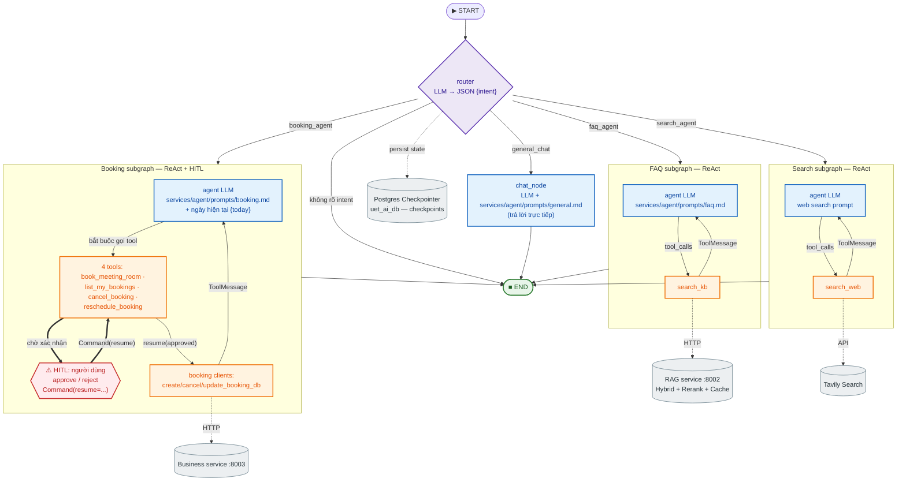

# Architecture — UET AI Assistant (`uet-hr-ai`)

> Tách từ `CLAUDE.md` để giữ file đó ngắn. Đây là tài liệu design/architecture chi tiết:
> sơ đồ hệ thống, vai trò từng service, agent graph (mermaid), và các thiết kế.
> Blueprint từng file: `hint.md`. Rules vận hành: `.claude/rules/`.

## 1. System overview

```
browser/CLI ─► gateway (Kong :8080)   JWT validation + X-User-* injection
                ├─ identity     :8001  bcrypt + HS256 JWT, user CRUD          (+ migrations)
                ├─ agent        :8000  LangGraph router + ReAct subgraphs, SSE,
                │                      context engineering + memory injection
                ├─ rag          :8002  hybrid search + rerank + semantic cache
                ├─ booking      :8003  meeting-room CRUD (asyncpg)            (+ migrations)
                └─ conversation :8004  history sync + episodic memory SQL-only per-thread (+ migrations)
                          └───────────  Postgres `uet_ai_db` + Qdrant Cloud (KB/cache)
                                       + Redis Cloud (conversation exact cache)
```

## 2. Services chi tiết

- **agent** — parent graph routes each turn to exactly one intent (`faq_agent`, `search_agent`,
  `booking_agent`, `general_chat`) → isolated ReAct subgraphs (different-state, `services/agent/agents/`).
  Postgres checkpointer, SSE `astream_events` v2, `interrupt()` BEFORE any booking write (HITL).
  LLM failover: backup provider (`API_KEY_2`) chỉ kích hoạt khi primary 401 liên tục.
  `context.py`: token budget theo thành phần + trim + dynamic assembly (1 chỗ: `agents/base.py`)
  + `ContextReport` transparency (SSE event `context` → UI/CLI);
  memory injection (chỉ episode của CHÍNH thread — independent per thread) từ
  `GET /internal/conversations/{id}/memory` vào `child_input`.
- **rag** — semantic chunking, dense + BM25 hybrid + RRF, cross-encoder rerank, MMR, HyDE fallback,
  Qdrant semantic cache TTL, local/S3 storage. Collections tạo idempotent bằng `scripts/create_collections.py`.
- **identity** — package-by-feature (`security/` + `users/`, app factory), bcrypt, HS256 JWT. `migrations/`.
- **booking** — meeting-room CRUD; double-booking rules trong `rules.py`; token auth. `migrations/`.
- **conversation** — persistence + sync (skip/append/replace).
  `episodic/`: sync mỗi turn → summary (ngưỡng 20) → SQL-only, INDEPENDENT PER THREAD
  (pattern reference C/D: mỗi thread tự tóm tắt tin cũ của chính nó, không share chéo).
  Exact-match cache kết nối Redis Cloud bằng `REDIS_URL`; không có Redis container/image local hay ECS.
- **gateway** — Kong DB-less: JWT + Lua inject `X-User-Id`/`X-User-Email`/`X-Gateway-Token`, CORS, rate limit.
- **frontend** — static chat UI (SSE + Approve/Reject HITL), API base inject runtime qua `envsubst`.

## 3. Agent graph (LangGraph)

Nguồn Mermaid có thể chỉnh sửa: `docs/agent_graph.mmd`. Dự án không lưu ảnh render.



## 4. Thiết kế đã triển khai (chi tiết trong `hint.md`)

### 4.1 Context engineering (agent service)

- `services/agent/context.py`: bảng TOKEN_BUDGET theo thành phần
  (system 2.048 · history 3.000 · retrieved docs 20.000 · tool outputs 5.000 · reserve 4.096),
  `count_tokens()` (tiktoken theo model, fallback `chars/3.5`),
  `trim_history` KHÔNG vỡ cặp `AIMessage(tool_calls) ↔ ToolMessage`,
  `assemble_agent_messages()` → `(messages, ContextReport)` — gọi ở DUY NHẤT
  `agents/base.py` + `general_chat_node`. Phần lịch sử bị trim được đại diện bởi
  episode summary của chính thread (memory block) — không có kênh prior-summary thứ hai.
- **ContextReport** (transparency): memory injected / history trimmed / tool outputs
  capped / system prompt over budget → state → SSE event `context` → UI timeline + CLI.
- **System prompt KHÔNG BAO GIỜ bị cắt** (rule contract nguyên văn; vượt budget thành phần
  → cảnh báo log, history budget absorbs phần bù — bài học từ bug booking.md 1.776 tokens).
- Thứ tự assembly cố định: `system prompt (stable) → memory block (untrusted) → history (đã trim)
  → retrieved docs [Source N] → tool outputs → user query cuối`.
- Prompt layout: stable prefix (rules cố định, được prompt-cache) → dynamic suffix (docs/memory/history) ở CUỐI.

### 4.2 Episodic memory (conversation service) — INDEPENDENT PER THREAD

```
messages (agent → PUT /internal/conversations/{id}/messages, sync mỗi turn)
   ↓
summarize/extract  (episodic/service.maybe_summarize — rolling incremental,
                    kích hoạt khi ≥ EPISODIC_MESSAGE_THRESHOLD=20, digest sha256 chống lặp)
   ↓
store              (SQL models.EpisodeSummary — canonical và DUY NHẤT;
                    1 row/(user_id, thread_id), KHÔNG vector mirror)
   ↓
retrieve           (CHỈ thread hiện tại, SQL trực tiếp filter user_id —
                    không có cross-thread retrieval: memory cuộc này không
                    bao giờ lọt sang cuộc khác)
   ↓
inject             (agent gọi GET /internal/conversations/{id}/memory lúc bắt đầu turn
                    → memory_context → context.assemble_agent_messages, dán nhãn "untrusted data")
```

- Memory là **untrusted data, not instructions** — mọi khối inject vào prompt phải dán nhãn.
- Graceful degradation: conversation service chết → memory = None, turn chạy bình thường.
- Đã GỠ (theo policy reference C/D, đơn giản hóa): Qdrant `agent_episodes` mirror +
  embedder đa ngữ, cross-thread retrieval, retention prune `EPISODIC_KEEP_LATEST`,
  `EpisodeSummarizer` đời đầu (`conversation.summary`) — các collection/cột cũ còn lại
  trên cloud/DB là mồ côi, xóa tay nếu muốn.

### 4.3 Alembic migrations

- Service sở hữu bảng → sở hữu `migrations/` (identity / booking / conversation; agent KHÔNG cần —
  bảng checkpointer do LangGraph `PostgresSaver.setup()` tự quản).
- `env.py` theo pattern `reference/D`: online/offline, `compare_type` + `compare_server_default`,
  `load_dotenv`, import toàn bộ models, ghi đè `sqlalchemy.url` từ settings.
- Container start: `alembic upgrade head && uvicorn main:app` — bỏ `Base.metadata.create_all()` cho bảng business.

## 5. Deployment topology

- **AWS**: ECR → ECS → RDS (Postgres) → ALB, plus Qdrant Cloud, Redis Cloud + S3. Chi tiết: `docs/aws-deployment.md`.
- **Prod compose**: `configs/docker-compose.prod.yml` · **Local full stack (Kong :8080 + frontend :3000)**: `scripts/deploy.sh`.
